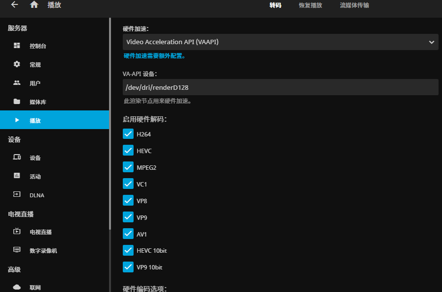

# 说明

PVE更新了7.4版本以后，官方提供了一个可选的6.2版本的内核，这样一来就可以通过自行将系统内核升级到这个版本来获得对Intel 12代以后CPU核显的直通能力了。这篇文档除了直通配置以外还包含了jellyfin硬解的配置。

# 操作步骤
## 1.升级pve内核至6.2版本

1.1设置软件源为：

```
deb https://mirrors.ustc.edu.cn/debian/ bullseye main contrib non-free
deb https://mirrors.ustc.edu.cn/debian/ bullseye-updates main contrib non-free
deb https://mirrors.ustc.edu.cn/debian/ bullseye-backports main contrib non-free
deb https://mirrors.ustc.edu.cn/debian-security bullseye-security main contrib 
deb https://mirrors.ustc.edu.cn/proxmox/debian bullseye pve-no-subscription
```

1.2更新源并查看可用的内核列表

```
apt update
apt search pve-kernel|grep pve-kernel-
```

1.3安装内核

```
apt install pve-kernel-6.2 
```

1.4查看内核列表，确实安装成功

```
proxmox-boot-tool kernel list
```

1.5将新内核设置为默认

```
proxmox-boot-tool kernel pin 6.2.11-1-pve
```

1.6 `reboot`重启系统

## 2.核查ubuntu虚拟机的设置

2.1系统需要是Default (i440fx)，bios选择Default (SeaBIOS)。

## 3.在PVE中配置核显直通

3.0 以超级用户身份登录

3.1`vi /etc/default/grub`编辑grub配置，将GRUB\_CMDLINE\_LINUX\_DEFAULT的值改为"quiet intel\_iommu=on video=efifb:off,vesafb:off i915.enable_guc=7"，配置全文如下

```conf
# If you change this file, run 'update-grub' afterwards to update
# /boot/grub/grub.cfg.
# For full documentation of the options in this file, see:
#   info -f grub -n 'Simple configuration'

GRUB_DEFAULT=0
GRUB_TIMEOUT=5
GRUB_DISTRIBUTOR=`lsb_release -i -s 2> /dev/null || echo Debian`
GRUB_CMDLINE_LINUX_DEFAULT="quiet intel_iommu=on video=efifb:off,vesafb:off i915.enable_guc=7"
GRUB_CMDLINE_LINUX=""

# Uncomment to enable BadRAM filtering, modify to suit your needs
# This works with Linux (no patch required) and with any kernel that obtains
# the memory map information from GRUB (GNU Mach, kernel of FreeBSD ...)
#GRUB_BADRAM="0x01234567,0xfefefefe,0x89abcdef,0xefefefef"

# Uncomment to disable graphical terminal (grub-pc only)
#GRUB_TERMINAL=console

# The resolution used on graphical terminal
# note that you can use only modes which your graphic card supports via VBE
# you can see them in real GRUB with the command `vbeinfo'
#GRUB_GFXMODE=640x480

# Uncomment if you don't want GRUB to pass "root=UUID=xxx" parameter to Linux
#GRUB_DISABLE_LINUX_UUID=true

# Uncomment to disable generation of recovery mode menu entries
#GRUB_DISABLE_RECOVERY="true"

# Uncomment to get a beep at grub start
#GRUB_INIT_TUNE="480 440 1"
```

3.2 `vi /etc/modules`添加如下配置，原本这个文件里只有注释，添加以后如下所示

```conf
# /etc/modules: kernel modules to load at boot time.
#
# This file contains the names of kernel modules that should be loaded
# at boot time, one per line. Lines beginning with "#" are ignored.

vfio
vfio_iommu_type1
vfio_pci
vfio_virqfd
```

3.3 `vi /etc/modprobe.d/blacklist.conf` 编辑黑名单，让pve开机不加载核显驱动,这个文件可以不存在，vi打开时是新建状态，添加完配置后文件全文如下

```conf
blacklist snd_hda_intel
blacklist snd_hda_codec_hdmi
blacklist i915
```

### 3.4 重载系统配置

3.4.1`update-grub`刷新grub配置

3.4.2`update-initramfs -u -k all`刷新initramfs

3.4.3`reboot`重启pve

3.4.4`dmesg | grep -e DMAR -e IOMMU -e AMD-Vi`查询系统状态是否确实开启了IOMMU

### 3.5 确定核显的设备号

3.5.1 执行`lspci`命令，可以看到pci设备的列表，大致如下：

```txt
root@aquar:~# lspci
00:00.0 Host bridge: Intel Corporation Device 4668 (rev 02)
00:01.0 PCI bridge: Intel Corporation Device 460d (rev 02)
00:02.0 Display controller: Intel Corporation AlderLake-S GT1 (rev 0c)
00:06.0 PCI bridge: Intel Corporation Device 464d (rev 02)
00:08.0 System peripheral: Intel Corporation Device 464f (rev 02)
00:0a.0 Signal processing controller: Intel Corporation Device 467d (rev 01)
00:14.0 USB controller: Intel Corporation Device 7ae0 (rev 11)
00:14.2 RAM memory: Intel Corporation Device 7aa7 (rev 11)
00:14.3 Network controller: Intel Corporation Device 7af0 (rev 11)
00:16.0 Communication controller: Intel Corporation Device 7ae8 (rev 11)
00:17.0 SATA controller: Intel Corporation Device 7ae2 (rev 11)
00:1c.0 PCI bridge: Intel Corporation Device 7ab8 (rev 11)
00:1c.1 PCI bridge: Intel Corporation Device 7ab9 (rev 11)
00:1c.3 PCI bridge: Intel Corporation Device 7abb (rev 11)
00:1f.0 ISA bridge: Intel Corporation Device 7a86 (rev 11)
00:1f.3 Audio device: Intel Corporation Device 7ad0 (rev 11)
00:1f.4 SMBus: Intel Corporation Device 7aa3 (rev 11)
00:1f.5 Serial bus controller [0c80]: Intel Corporation Device 7aa4 (rev 11)
01:00.0 VGA compatible controller: NVIDIA Corporation GP107 [GeForce GTX 1050 Ti] (rev a1)
01:00.1 Audio device: NVIDIA Corporation GP107GL High Definition Audio Controller (rev a1)
02:00.0 Non-Volatile memory controller: Samsung Electronics Co Ltd Device a809
04:00.0 Ethernet controller: Realtek Semiconductor Co., Ltd. RTL8125 2.5GbE Controller (rev 05)
05:00.0 SATA controller: ASMedia Technology Inc. ASM1062 Serial ATA Controller (rev 02)
```

其中可以看出来00:02.0是intel的核显。

3.5.2 执行`lspci -n -s 00:02` 命令得到完整的设备号8086:4680，记录下来下一步会使用。

```txt
root@aquar:~# lspci -n -s 00:02
00:02.0 0380: 8086:4680 (rev 0c)
```

3.6 `vi /etc/modprobe.d/vfio.conf `配置直通的核显信息，ids替换成3.5.2记录下来的设备号

```conf
options vfio-pci ids=8086:4680
```

3.7执行`update-initramfs -u`更新Initramfs

3.8 `reboot`重启pve

## 4.配置ubuntu

4.1在ubutnu虚拟机的硬件配置中添加00:02的pci核显设备。


4.2安装intel驱动

```bash
sudo apt-get install -y gpg-agent wget
wget -qO - https://repositories.intel.com/graphics/intel-graphics.key | \
  sudo gpg --dearmor --output /usr/share/keyrings/intel-graphics.gpg

echo 'deb [arch=amd64,i386 signed-by=/usr/share/keyrings/intel-graphics.gpg] https://repositories.intel.com/graphics/ubuntu jammy arc' | \
  sudo tee  /etc/apt/sources.list.d/intel.gpu.jammy.list
```

4.3安装intel\_gpu\_tools

```
apt install intel-gpu-tools
```

4.4安装vaapi

```bash
sudo apt install libmfx1 libmfx-tools
sudo apt install libva-dev libmfx-dev intel-media-va-driver-non-free
```

4.5 添加环境变量

```
cat >> /etc/bash.bashrc <<EOF
export LIBVA_DRIVER_NAME=iHD
EOF

```

4.5 `vim /etc/modprobe.d/i915.conf`配置文件

```
options i915 enable_guc=2
undate-initramfs -u -k all
```

4.5 查看核显状态，验证是否正常直通

```
sudo apt install hwinfo
hwinfo --display

sudo apt-get install vainfo
sudo vainfo
```

## 5.配置jellyfin

5.1 jellyfin的docker-compose.yml配置如下，硬解的关键在于把核显驱动映射到容器内部，就是最后两行的devices配置

```
 jellyfin:
    image: nyanmisaka/jellyfin
    container_name: jellyfin
    network_mode: host
    environment:
      - TZ=Asia/Shanghai
        # - JELLYFIN_PublishedServerUrl="http://192.168.0.118:8096" #optional
    volumes:
      - /opt/aquar/storages/apps/jellyfin/config:/config
      - /opt/aquar/storages/apps/jellyfin/cache:/cache
      - /opt/aquar/storages/aquarpool/movies:/media
    restart: unless-stopped
    privileged: true
    devices:
      - /dev/dri:/dev/dri
```

5.2 在jellyfin中设置硬解，进入设置菜单->控制台->播放，将硬件加速下拉框选为VAAPI，VA-API设备会默认为/dev/dri/renderD128，你需要核对你的docker宿主机的核显驱动是否是他。然后吧所有能勾的编码选项都勾上，把下面的启动色调映射也勾上。




完成。